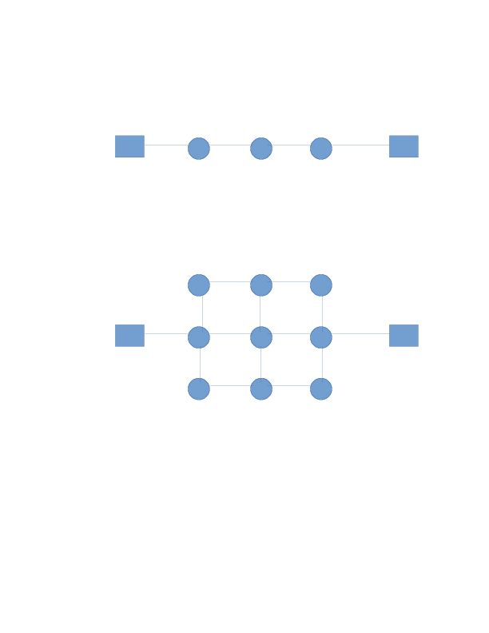

In your groups, answer the following questions.
No need to report the answers to me --
this is just for practice.
We may not get through all of the questions every week.
You may want to take notes during the discussion,
because these questions will be helpful in reviewing for exams.

Note: some questions are taken entirely or in part from your textbook.

# General Questions

1. Choose one group member to act as [server 1](protocols/server-1.md)
and another to act as [client](protocols/client.md)
and play out the communication between the two.
Continue until the protocol says to quit or until you believe the protocol has
failed.
Then have other members act as [server 2](protocols/server-2.md)
and [client](protocols/client.md).
Continue until the protocol says to quit or until you believe the protocol has
failed.
Discuss your general experience and anything it demonstrated about protocols
in general.

2. Give an example of a protocol that people use in everyday life to
communicate with one another.
Are there ways in which people can deviate from the protocol?
If so, what happens?

3. When connecting two computers, do you believe it is necessary to have a
packet switch between them?

4. We will soon be learning how email is implemented.
Do you expect it will be implemented in the network core or at the network
edge? Why?

5. Do network layer protocols need to be implemented differently on nodes that
are connected via Ethernet vs nodes that are connected via WiFi?
Why or why not?

6. A professor at University of Atlantis just invented a brilliant network
protocol that will make routing messages much more efficient.
Atlantis replaces all of their internet-connected devices with ones that run
the new protocol.
Will the underwater citizens see significant improvement to their Netflix
download speeds?
Why or why not?

7. What is the purpose of the IETF and the RFCs that they publish?

8. Which of these networks would you expect is more resilient to failures? Why?
In what ways is the more resilient network still not particularly resilient
(i.e., what are its "weak points"?)
Can you think of any advantages to the other network?

For the next few questions, assume all links have a transmission rate of 1000
bits/second.
Also, assume there is no other traffic on the network and that propogation
delay is negligible.

9. Host A is connected to host B via a path containing 4 routers.
Assume a single packet is up to 1000 bits in size.
How long will it take for A to transmit 1000 bits to B?

10. Same setup as the previous question,
but a single packet can now be up to 500 bits in size.
How long will it take for A to transmit 1000 bits to B?
(We did not do one exactly like this in lecture;
do your best to puzzle it out.)

11. From your work above,
can you generalize how long it takes to send
    * P packets,
    * each of length L bits,
    * over N links (N - 1 routers)
    * that have transmission rate R bits/second?

12. Why is packet loss to be expected in a congested network?

13. An application is sending message *m* to another application.
Header information will need to be added and removed as the message makes its
way through the network.
When will the message be larger:
when it is handled by the link layer,
when it is handled by the transport layer,
or it will be the same size in both cases?
Why?

14. Imagine you have a dog that is sick.
You want to remedy this by having the dog see a vet,
but you don't have time to go.
Instead, you enlist the help of a trusted friend.
* You give the dog to your friend to be taken to the vet.
* The friend bikes with your dog from your house to the bus station.
* The friend and dog ride the bus to the nearest town.
* They then disembark and walk to the vet.
* The vet gives the dog some medicine.
* Your friend and the dog return to you via the same route.
Explain this process in terms of the network protocol stack,
particularly the application, network, and link layers.

15. Consider having a basic home phone for voice-only communication.
Is your phone a client, a server, both, or neither?
Explain.

16. Each of the real-life situations below involve interacting parties
(though some parties may not be mentioned explicitly).
In networking terms,
describe who is the "client" and who is the "server" in the scenarios.
* You and your friends decide to call GrubHub to order late-night food.
* A child is operating a lemonade stand.
* You attend the office hours of your networking professor.
* My dog runs to me because I shook his food bowl to announce dinner.

17. When I was in elementary school
(and this might still happen today,
but I doubt it),
teachers had a protocol for passing news of a snow day.
When the first teacher found out about the snow day from the superindentent,
they would call another teacher.
That second teacher would call a third,
and so on until all teachers knew about the snow day.
Is this protocol client-server or peer-to-peer?
If it is client-server,
who is the client and who is the server?
If it is peer-to-peer,
how can you tell?
