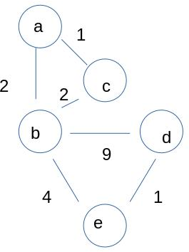
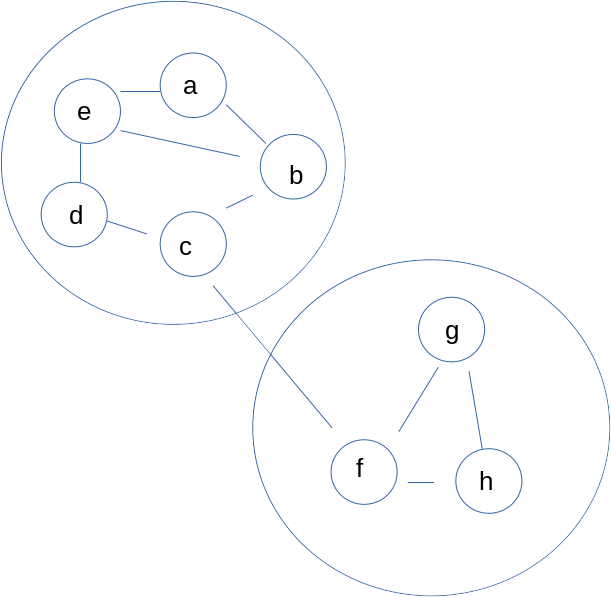

# General Questions

1. Cities A and C are joined by a road that goes through City B.
   City B has a law against driving personal cars on their roads --
   they allow only semis.
   A driver who wants to get from City A to City C must load their car into
   a semi to travel through City B.
   When they arrive at City C, they can unload their car and continue as usual.
   How does this relate to routers and IP?

2. How many IPv6 addresses are there?
   How does this compare to the number of IPv4 addresses?

   Assume every IPv4 address were used up.
   How many IPv6 addresses could be assigned to every single IPv4-addressed
   host before the IPv6 address space was exhausted?

3. Are there more IPv6 addresses or...
    * stars in the known universe?
    * grains of sand on the earth?
    * Pokemon?

4. If you order a meal at SimpleBurger,
   you do not get to choose much about your food.
   Every meal is a plain beef patty and a side of plain fries.
   At BetterBurger,
   you can customize by adding pickles, onions, ketchup, and so on to your
   order.
   What might be an advantage to ordering at SimpleBurger?
   Is there any way to get the "features" of BetterBurger while retaining the
   advantages of SimpleBurger?
   What does this have to do with IP?

5. Your professors at GVSU have come up with a new IP version (IPv457) that is
   obviously superior to IPv6.
   They propose that this new version be adopted throughout the Internet by
   2025.
   Does this strike you as reasonable?
   Why or why not?

6. IPv6 does not include fragmentation.
   However, it is still possible that an IPv6 datagram ends up fragmented
   as it travels from its source to its destination.
   How can this happen?

<!--
7. An IPv6 address is usually broken into chunks of four hex digits with the
   chunks separated by colons.
   How many chunks of four are the addresses broken into?
   (Try to figure this out without looking it up --
   use what you know about the number of possible IPv6 addresses.)
-->

7. Explain the relationship between forwarding and routing.

8. What are some different criteria that might be used in determining which
   path to take through the network?

9. You are seated in a large, dark room,
   and you want to pass a message to your friend Jim Kirk who is far away in
   the room.
   You ask the three people sitting by you whether if you pass them a note they
   can eventually get the message to Jim.
   One of them says they don't know where he is,
   another says they can eventually get the message but it will be slow,
   and the third says they are just a few seats away from him.
   What kind of routing algorithm,
   distance-vector or link-state,
   are you using to determine where to pass your note?

10. What is the difference between static and dynamic routing?
   Give an advantage and disadvantage of each.

11. Consider a router that knows the minimum distance from each of its neighbors
    to each end host on the system.
    That router is running a... (link state or distance vector)
    ...routing algorithm.



12. Run Dijkstra's algorithm on the image above to find the shortest path from
    `a` to each other node.

13. Running Dijkstra's algorithm with node `u` as the starting point results in
    the following table of distances and predecessors in the format used in the
    lecture video once the algorithm has finished.
    ```
    | v   | w   | x   | y   | z   |
    | --- | --- | --- | --- | --- |
    | 5,z | 2,u | 3,u | 9,x | 4,w |
    ```
    What is the least-cost path from `u` to `v`?
    What is the cost of that path?

14. Using the results above,
    write out the forwarding table for the router `u`.

15. Which of the following could be sensible choices to use as link costs?
    * Physical distance
    * 1/(Physical distance)
    * Congestion
    * Link bandwidth
    * 1/(Link bandwidth)

16. A busy highway forks into two roads that eventually end up in the same
    town.
    On Monday, most of the drivers go left at the fork.
    This makes the left fork slow,
    and they hear from their friends who went right that it was faster.
    So, on Tuesday, most of the drivers go right at the fork,
    resulting in the right fork being substantially slower.

    What is the corresponding problem that can occur in routing?

17. Consider a three-router network with routers `A`, `B`, and `C`.
    The initial distance vector for `A` is given below.
    ```
    |    | A   | B   | C   |
    | ---| --- | --- | --- |
    |  A | 0   | 5   | 2   |
    ```
    `A` then receives these two distance vectors from its neighbors.
    ```
    |    | A   | B   | C   |
    | ---| --- | --- | --- |
    |  B | 5   | 0   | 1   |
    |  C | 2   | 1   | 0   |
    ```
    What is the updated distance vector for `A`?

18. You and your best friend are discussing routing algorithms at the bar on
    Friday night as you always do.
    Your friend claims that distance-vector algorithms are horribly inefficient
    in the long run because all of the routers are constantly passing their
    distance vectors back and forth with their neighbors.
    Do you agree or disagree? Why?

19. In the example from two questions ago,
    would `A` have sent a new distance vector to its neighbors after the
    update?
    If so, change the vectors from `B` and `C` to ones that would *not* result
    in `A` sending an updated vector.
    If not, change the vectors from `B` and `C` to ones that *would* result
    in `A` sending an updated vector.

20. You and your friends often share textbooks to save on costs.
    Typically, if you need to get a textbook to your friend Nyota,
    you give it to your friend Spock because they live near one another.
    If Spock asks you whether you have a convenient way to get a book to Nyota,
    you might say "No" because you typically would use him as your
    intermediary.
    Where does this same idea come up in routing, and why?

21. Imagine you are trying to get to a distant town,
    and your trip will involve several steps:
    flights, train rides, buses, and so on.
    No matter which route you take,
    your first step is going to be to have one of your friends drop you off at
    an airport near them.
    Consider two situations:

    1. You use the internet to get information about various legs of the
       trip -- how long is the bus ride from A to B,
       how long is the plane ride from C to D, and so on.
       You then ask each of your friends how long it takes to get from their
       house to the nearest airport to them,
       and you use the resulting information to decide which friend will drop
       you off for the first leg of your trip.

    2. You ask each friend "how long will it take to get from your house to my
       final destination?"
       All of your friends give you their best estimate,
       and you use that information to decide which one will drop you off for
       the first leg of your trip.

    If you are concerned that one of your friends, Khan, might be a liar,
    which scenario is safer for you? Why?
    How does this relate to routing?

22. Why is it useful to have different protocols for intra-AS vs inter-AS
    routing?

23. Why is it useful for OSPF to authenticate its messages?

24. In your own words, what do the `AS-PATH` and `NEXT-HOP` attributes of BGP
    messages mean?
    Why are they important?

25. BGP is a distance-vector (actually, a path-vector) protocol.
    Do you think that this is a coincidence,
    or are there any reasons why a distance-vector protocol is naturally a
    better fit for an inter-networking protocol than a link-state protocol
    would be?

26. As a network admin,
    you decide that you do not care much which other ASes your packets are
    routed through --
    you care only how long they will take to get to their final destination.
    Hoping that others are of a similar mind,
    you modify your routers' BGP protocol to send a `DISTANCE` value instead
    of the `AS-PATH` value in order to help out your neighbors.
    Will your network see any benefit from this change?
    Why or why not?

27. Consider an internet company named Nile that sells and ships various
    products and has a massive distribution system across the US that includes
    several warehouses in every state.
    Even though Nile is all one company,
    warehouses from Maine do not generally ship directly to warehouses in
    Arizona.
    Instead, they ship to regional centers,
    and the regional centers ship to a national center.
    The national center then ships to a different regional center who is
    responsible for shipping to the final destination warehouse.
    What is the routing equivalent of this situation?

28. Is an AS required to release detailed information about its internal
    structure in order to connect to the public internet.
    Why or why not?

29. Consider routing a packet to a distant prefix `X`.
    For each of the following, state whether it is the responsibility of BGP
    or OSPF.
    * Determining which ASes packet will go through along the way.
    * Determining which gateway router with local AS packet should be sent to.
    * Determining which outgoing link is used to forward packets toward gateway
      router.

30. Which, if either, is more likely to receive widespread adoption:
    a new protocol that improves on BGP,
    or a new protocol that improves on OSPF?
    Why?



31. In the image above,
    large circles represent ASes.
    Assume that when `a` receives a packet destined for `f`,
    it will forward the packet to `e` to eventually be sent out of the AS via
    `c`.
    When `a` makes that choice,
    how does it modify the header in order to let `e` know what it intends
    before forwarding `e` the packet?

32. Explain a few ways in which pure hot-potato routing,
    without consideration of the other factors that go into BGP route selection,
    could lead to a "bad" choice of path.

33. A network admin decides to save disk space by uninstalling all programs
    implementing the BGP protocol from any non-gateway router on the network
    since they will not communicate with other ASes.
    Is this a good idea? Why or why not?

34. You and your neighbor both own large farms.
    Your neighbor decides to open up a small carnival on their land.
    Because you are on friendly terms,
    you allow them to put up a sign on your land advertising for their
    carnival,
    and you even allow a small footpath through your woods that people who
    want to get to the carnival can use.

    After a while,
    you get sick of all of the foot traffic,
    so you simply take down the sign,
    and nobody bothers to walk that way because they do not know the carnival
    can be reached through your woods.
    Explain how something similar can happen in routing.
