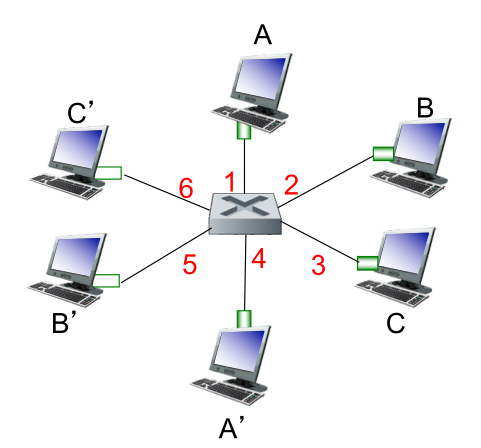

# General Questions

1. Assume all physical media involved and all Ethernet adapters involved on a
   particular subnet run 100 Mbps Ethernet.
   Which will generally result in a higher effective throughput on the subnet?
   * bus-based Ethernet
   * switched Ethernet

   Why?

2. Ethernet includes a cyclic redundancy check for bit errors.
   Given that, is Ethernet considered a reliable protocol?
   Why or why not?

3. What is the purpose of the `type` field in the Ethernet header?
   What would be the analogous field in a transport layer header?

4. Ethernet can be considered both a ____-layer and a ____-layer protocol.

5. You take a job doing office work for a small company with 8 other employees.
   You boss hands you a memo to give to Tom,
   but you have no idea who Tom is.
   To make matters worse,
   the office doors in the company are not labeled with people's names because
   they just moved to a new building.
   So, you make 7 copies and give them to everyone besides your boss herself.
   Eventually, Tom sends a memo to Pam,
   and you make a note of which office Tom came out of so that you can send
   future messages directed at Tom directly to his office.
   What is the networking equivalent of the system you have set up?

6. Consider the office scenario above.
   Would this system work better in an office with 8 employees or 800
   employees?
   Why?

7. In the office scenario,
   if the memo simply read
   "Buy 100 reams of paper"
   with no other text,
   would you want to add additional information to it before making copies and
   sending them?
   Why or why not?
   Would the networking equivalent of you as the "secretary" need to worry
   about this?

For the next few questions,
consider the following image taken from the slides provided by the textbook
authors.
Note that the hosts are connected via a *switch*,
not a router.

8. Consider the following statement:

   Before host A can send to host C,
   it must learn the MAC address of interface 1 of the switch.

   If this is true,
   how does A learn the MAC address?
   If not, why not?

9. Assume all other hosts want to send to A at the same time.
   If the network is running 100 Mbps Ethernet,
   what is the rate at which data is received by A?

10. Give a few similarities and differences between a switch table and a routing
    table.

11. In the diagram above,
    if B wanted to read frames meant for A,
    how could it trick the switch into sending those frames to B?

12. Why is the issue raised in the previous question typically not considered
    a problem in practice?
    (I.e., why do we not worry much about defending against this "attack"?)

13. Assume the switching table for the network above is initially empty.
    Host A sends to host B, then host B sends to host C.
    What does the switching table look like after this process is complete?

14. Give a disadvantage of having a very large switched-Ethernet LAN.

15. Consider the two scenarios below.
    Explain which is more similar to ARP and which is more similar to a
    self-learning switch and why.
    * Scenario A: You are playing soccer (football) on a new team.
      The play calls for you to pass to Lionel.
      You shout their name ("Hey Lionel!") because you do not know their
      jersey number.
      Lionel responds with their number ("I'm #10!"),
      and from that point on whenever you are supposed to pass to Lionel,
      you pass to #10.
    * Scenario B: You are a teaching assistant tasked with passing messages
      between students and the professor during exams.
      When a student passes a note to the professor,
      you glance at the student's name on the note and record which seat they
      are sitting in in case the professor writes a note back that you need
      to deliver.

16. Describe in general the similarities and differences between ARP and a
    self-learning switch.
    Consider both how they learn and their purpose.

17. Unlike most previous protocols we have seen,
    Ethernet specifies both header *and* footer information that should be
    attached to a message.
    However, the Ethernet header does not contain any information about
    message length.
    How does the Ethernet receiver know when the payload ends and the footer
    begins?
    (Note: this is something that Ethernet handles itself --
    it does not look at the higher-layer package to determine the length of
    the data.)

# Review questions

At this point in the course,
you know the basics of at least one protocol at every layer from link up
through application and hopefully how they are used together.
We still have a few topics left to learn,
but in honor of the review lecture
("A Day in the Life of a Web Request")
we will take a high-level look back at some previous topics in this next set of
questions.

18. If a host is going to run a web server,
    it must support protocols from which layers of the protocol stack?
    List a few protocols in particular that the host must support and why.

19. What is the payload of an IP datagram?

20. If my computer is connected to my router through a reliable link-layer
    protocol,
    why might TCP still be useful in supporting reliable data transfer?

21. Consider the opposite case:
    If most traffic on the internet were carried via TCP
    (which is not necessarily true -- I was unable to find numbers for this),
    why might reliable transfer at the link layer still be useful in some
    cases?

22. Your manager requests that you upload your reports in a specific format.
    You realize that the format is inefficient,
    so you upload yours in a slightly different, but far superior, format.
    If your manager is using a script to aggregate reports from all employees,
    what is the likely result of your cleverness?
    How could something similar come into play in networking?

23. Which are more common on the internet:
    * nodes that understand the HTTP protocol, or
    * nodes that understand the IP protocol?
    
    Why?

24. Is a DHCP request sent over IP?
    * If so, does it have a (meaningful) source address?
      Why or why not?
    * If not, why not?

25. UDP is a more bare-bones protocol than TCP,
    but it is used as the transport layer protocol for DNS,
    and DNS is very important to allowing the internet to function correctly.
    Why might UDP be the protocol of choice for DNS?

26. From a programmer's perspective,
    which do you believe are more similar to each other:
    * a TCP client socket and a UDP client socket, or
    * a TCP server socket and a UDP server socket?

    Explain.

27. What is the purpose of a forwarding table in a router.
    Explain (in as much detail as you care to) how a forwarding table is
    created for an internet-connected router.

28. Recall that IPv6 uses a 128-bit address space.
    Also recall that there were 150 Pokemon in the first generation.
    For how many generations will we have enough IPv6 addresses to label all
    Pokemon if
    * the number of Pokemon grows by 150 each generation?
    * the number of Pokemon doubles every generation?

29. Large fast-food chains will sometimes have multiple lanes in their
    drive-throughs.
    Typically the lanes will take turns when merging into one lane,
    so a driver from Lane 1 will go, then Lane 2, then Lane 1 again, and so on.
    What kind of queueing policy is this if we assume...
    * drivers in both lanes take the same amount of time to order?
    * drivers in Lane 1 take twice as long to order,
      so two cars from Lane 2 get through for every car in Lane 1?

30. Give a few examples of types of DNS records that do *not* contain IP
    addresses and explain what they contain instead.

31. Consider switched Ethernet with a full-duplex connection,
    meaning that traffic can move in both directions at the same time without
    causing a collision.
    Why is a random-access MAC protocol a good choice in this case?

# Wireless questions

1. When you are connected to a WiFi network at someone's home,
   you are usually connected directly to their wireless router.
   Why does this wireless network not require a base station?

2. Consider a fairly standard wireless setup where several hosts are connected
   to a base station that is then connceted to a router via Ethernet.
   A friend from your networking class makes the observation that connecting
   in this way is similar to using non-switched Ethernet to connect to the
   router.
   What are your thoughts on your friend's analogy?

3. Give some similarities and some differences between a wireless base station
   and an Ethernet switch.

4. You and some friends decide to take a trip to the deserted wasteland of
   Houghton, MI.
   You all bring your WiFi-capable computers,
   but there are no wireless access points to connect to.
   Is there any way you can use WiFi to send messages back and forth amongst
   each other while you are there?
   Can you connect to the larger internet?

5. Due to soaring prices for phones,
   the telegram office in your town becomes very popular once again.
   The telegram officer is grumpy and does not like accepting handwritten
   notes from people to send out as a telegram.
   Instead, he hires a scribe to jot down your spoken message and hand it to
   him to send out.
   Because of the sudden jump in demand,
   there is not a great system in place for communicating with the scribe.
   Instead, anyone in the office can speak to the scribe at any point,
   and, if the scribe hears the customer clearly,
   they will pass the message along to the telegram officer.
   What piece of networking equipment does a similar job to the scribe?

6. You are trying to coordinate a family reunion involving two cousins who
   do not get along with one another.
   Rather than send a lot of messages back and forth,
   you want to coordinate via phone,
   and you want to speak to them both at once to get it over with.
   Because they can't stand to talk to one another,
   you have two separate conversations going with them over two phones at the
   same time.
   Unfortunately,
   this results in them frequently both trying to talk to you at the same time,
   in which case you are unable to hear what either says.
   Where does this same problem come up in wireless networking?

7. You speak Spanish much more quickly than English,
   but not as fluently,
   so you cannot understand Spanish if you are in a crowded room or speaking to
   someone who is very quiet.
   Your English is slower,
   but you can understand it even when spoken very softly.

   You and your friend are first to a party,
   so you are happily chatting away in Spanish.
   Later, as the party gets noisier,
   you switch to English to be sure you can understand one another.
   How can something similar happen in computer networks?

8. You are standing guard on an enormous wall with watchtowers every few
   hundred feet.
   If you see anything suspicious,
   you are supposed to call it out to the watchtowers on both sides of you.
   Suddenly, from your left, you hear a call of
   "Beware, there is...".
   At this point, a call comes in from your right:
   "Oh my, they're...".
   Unfortunately, you can't hear the details from either side because both are
   speaking to you at once without realizing it,
   so a portion of your wall gets blown up by an orc with magic dynamite and
   the invaders breach it.
   What problem shared with wireless networking was the downfall of your
   fortress?
