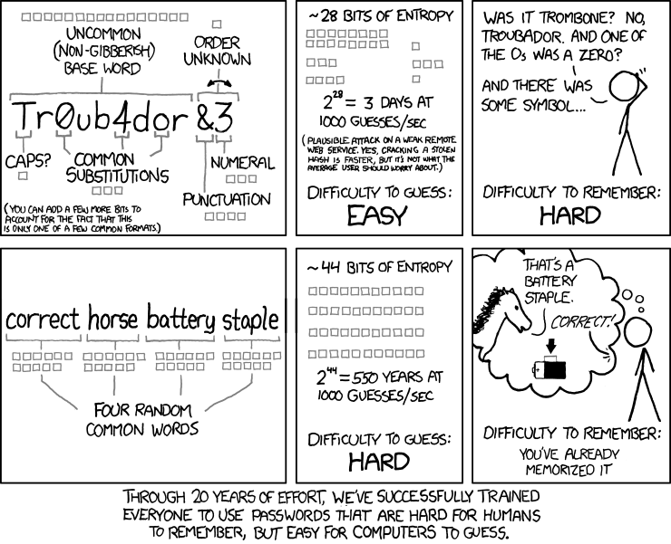

# General Questions

1. Give a few ways other than eavesdropping (reading your messages) that an
   attacker can harm you.

2. Given the cipher below,
   decode the following message: `hqwthkxgugxgp`
   ```
   abcdefghijklmnopqrstuvwxyz original
   cdefghijklmnopqrstuvwxyzab cipher
   ```

3. Use the two ciphers below in the repeating pattern
   `(cipher1, cipher1, cipher2)`
   to encrypt the following message : `grandvalley`.

   ```
   abcdefghijklmnopqrstuvwxyz original
   cdefghijklmnopqrstuvwxyzab cipher1
   yzabcdefghijklmnopqrstuvwx cipher2
   ```

   What information would I need in order to read your message?

4. If I put the above encryption scheme on my website and asked people to
   encrypt their messages to me using that scheme,
   why would that not be an effective way to keep your messages to me private?

5. The DES encryption scheme has a 56-bit key.
   How many more key options are there in AES with a 256-bit key?
   How much longer would it take to brute-force search all keys in 256-bit AES
   vs 56-bit DES?

6. Read the following comic
   (credit: [https://xkcd.com/936/](https://xkcd.com/936/)).
   There's really no question here; I just think everyone should read it.
   Discuss your thoughts on it with your fellow group members.

   

7. Consider a building in which everyone has a mailbox.
   If you know a resident's address,
   you can slide a message into a slot in their mailbox.
   The mailboxes are locked so that only the resident of a particular address
   can open a particular mailbox.
   What security topic from this course does this scenario remind you of?

8. If Natasha wants to send a private message to her friend Clint using
   public-key cryptography,
   which of the following conditions must be met for the message to be
   encrypted so that only Clint can read it?
   * Natasha knows Clint's public key
   * Natasha knows Clint's private key
   * Clint knows Natasha's public key
   * Clint knows Natasha's private key

9. If a website asks you to upload your public key so that it can send you
   encrypted messages but you accidentally upload your private key,
   will you be able to read the messages sent to you by the website?
   If so, is there a possible downside?
   If not, why not?

10. Choose the options that make the following sentences correct:
    Sending an encrypted message requires the {sender|receiver}'s
    {public|private} key.
    Sending a signed message requires the {sender|receiver}'s
    {public|private} key.

11. Public and private keys have the property that they can be applied in
    either order --
    that is, `pub(priv(m)) == priv(pub(m)) == m`.
    This feature allows us to use them for both signing and encrypting
    messages.

    Would it be a good feature if the keys were also the inverse of
    themselves --
    that is, if `pub(pub(m)) == m` and `priv(priv(m)) == m`?
    Why or why not?

12. If you have a quantum computer,
    you can use a process called Shor's algorithm to find the prime factors of
    integers in polynomial time.
    The fastest known algorithms for factoring an integer on a classical
    (non-quantum) computer are superpolynommial (worse-than-polynomial) time.
    (Basically, think things like $$n^2$$ vs things like $$2^n$$.)

    Why might the availability of a large quantum computer be of concern to
    people using RSA to encrypt their data?
    (Your answer does not need to be particularly technical.)

13. Your friend has developed a secure chat application using public-key
    cryptography.
    Early reviewers have compained that although the app is secure,
    there is a noticeable delay when sending large messages.

    Although using symmetric-key cryptography would speed up the encryption and
    decryption process,
    your friend believes it would be cumbersome for the users to need to share
    a symmetric key.

    Explain how your friend can "get the best of both worlds" --
    allowing users to deal with public-key encryption but getting them
    the speed of symmetric-key encryption.

14. If I sign a document written in pencil,
    I run the risk that someone will erase part of the document and rewrite it,
    making it look as though I signed something I did not.
    If a document is written in pen,
    an attacker would need to cross out part of the document and rewrite it,
    making it obvious that the message had been modified.
    Is "encrypting" a document with my private key more similar to the pen
    example or the pencil example?
    Explain.

15. Does "encrypting" a document with my private key provide confidentiality
    for the contents of the document.
    Why or why not?

16. You download a Linux distribution for installation and,
    because you are a responsible computer user,
    you also download a file `SHA256SUMS` and another file `SHA256SUMS.gpg`.
    The first file is a hash of the installer that you downloaded.
    The second file is the same hash file,
    but signed by the Linux maintainer's private key.

    Describe, at a high level, the steps you should take before you run the
    installer.
    Notes:
    * I do not know or want the exact shell commands --
      just describe the general process you would follow.
    * This question has *nothing* to do with Linux specifically.
      Rather, think of the installer as a message and consider the steps you
      should take before trusting it.

17. Your solution to the previous question should have involved a few steps.
    For any given step,
    what could go wrong if you did not include that step?

18. My computer is old and slow,
    and I want a hash function that can run quickly.
    So, I come up with the following function `fasthash(m)`:
    count the number of vowels in `m` and store it as an unsigned 32-bit
    integer,
    wrapping around to `0` if the number gets too large to store in 32 bits.
    Which desired attributes of a hash function does my function meet?
    Which does it fail to meet?

19. Consider the hash function from the previous problem.
    I send and "sign" the message `hey lets be friends` to Prof. Kurmas by
    sending the plaintext along with
    `private_key_apply(fasthash(message))`.
    How could an attacker who can modify my message in transit make me look
    bad?

21. Assume you getting letter stating that you are now the proud owner of
    an expensive antique car bought at auction and that you owe several
    thousand dollars to pay for it.
    You did not actually buy the car,
    but someone bought it in your name and signed for it.
    You protest that the receipt does not have your actual signature,
    and you are able to produce old documents from your bank proving that you
    sign papers differently than whoever bought the car.
    Because you have proof,
    the auction house has no choice but to stop hassling you to pay.
    In terms of public-key cryptography,
    what role did the bank play in this scenario?

22. Symmetric-key cryptography provides confidentiality of a message.
    If we want to provide message integrity and sender authentication using
    symmetric key cryptography,
    do we need to take additional steps?
    If so, describe a possible way to provide those features.
    If not, explain why not.

23. Is it possible to send an encrypted and signed message using public-key
    cryptography with just one public-private key pair?
    If so, explain how it would be done.
    If not, explain why not.

24. In the slides,
    a secure email is sent by first signing and then encrypting the message.
    If we performed those steps in the opposite order
    (i.e., encrypted the message and then signed the encrypted message),
    would the message still
    * be unreadable to outsiders?
    * be verified as coming from a partiular sender?
    * be verified as being unchanged?

    If all of the above were satisfied,
    would there be any other possible downside to sending this way?
